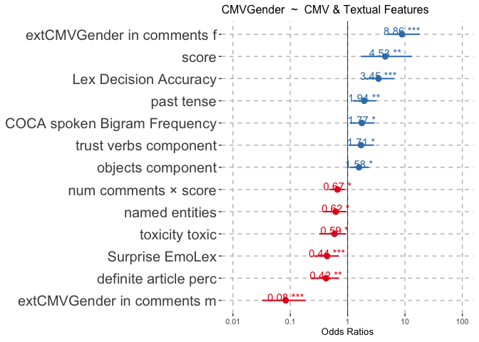

regression_analysis
================

``` r
library(stats)
library(corrplot)
library(dplyr)
library(MASS)
library(sjmisc)
library(sjPlot)  
library(car)
library(ggplot2)
```

### Load Falenska et al. LREC-2024 Data for Analysis

Preprocess gender_source,sentiment values

``` r
data <- read.csv('data/lrec2024_data.csv')

# gender_source values: explicit mentions:1; extended gender:0
data$gender_source <- ifelse(data$gender_source == 'explicit', 1.0, 0.0)
data$sentiment <- ifelse(data$sentiment == 'negative', -1,
                       ifelse(data$sentiment == 'neutral', 0,
                              ifelse(data$sentiment == 'positive', 1, NA)))
```

### Sanity check

Print cols with standard deviation = 0

``` r
sds <- apply(data[, 4:ncol(data)], 2, sd)
names(sds[sds == 0])
```

    ## [1] NA

## Colinearity Check

1.  Run hierarchical clustering on all features
2.  Return clusters with a Spearman correlation higher than threshold =
    0.5

``` r
get_clusters <- function(cor_matrix, threshold) {
       dist_matrix <- as.dist(1 - cor_matrix)
       if (any(is.na(dist_matrix)) || any(is.infinite(dist_matrix))) {
              dist_matrix[is.na(dist_matrix)] <- mean(dist_matrix, na.rm = TRUE)
              dist_matrix[is.infinite(dist_matrix)] <- mean(dist_matrix, na.rm = TRUE)
       }
       hclust_res <- hclust(dist_matrix, method = "ward.D2")
       clusters <- cutree(hclust_res, h = threshold)
       return(clusters)
}

cor_matrix_spearman <- cor(data[, 4:ncol(data)], method = "spearman")
correlation_threshold <- 0.5       # correlation threshold for colinearity check
clusters <- get_clusters(cor_matrix_spearman, correlation_threshold)
```

3.  Update data: select only one feature from each high colinearity
    cluster

``` r
update_data_for_colinearity <- function(clusters, cor_matrix_spearman, data) {
       for (cluster_id in unique(clusters)) {
              if (length(colnames(cor_matrix_spearman)[clusters == cluster_id]) > 1){
                     list_length <- length(colnames(cor_matrix_spearman)[clusters == cluster_id])
                     # Drop either all but first or all but last items in clusters with colinearity
                     if (cluster_id == 13 || cluster_id == 57 || cluster_id == 63){ 
                            columns_to_drop <- colnames(cor_matrix_spearman)[clusters == cluster_id][1:(list_length - 1)]
                     }
                     else if ( (cluster_id !=29 && cluster_id < 53) || cluster_id == 59 ){
                            columns_to_drop <- colnames(cor_matrix_spearman)[clusters == cluster_id][-1]
                     }
              data <- data[, !colnames(data) %in% columns_to_drop]
              cat("Cluster", cluster_id, ":\n")
              cat(colnames(cor_matrix_spearman)[clusters == cluster_id], "\n\n")
              }
       }
       return(data)
}
data <- update_data_for_colinearity(clusters, cor_matrix_spearman, data)
```

    ## Cluster 1 :
    ## flesch_readability content_poly 
    ## 
    ## Cluster 2 :
    ## negative_adjectives_component hu_liu_neg_nwords 
    ## 
    ## Cluster 6 :
    ## nwords num_quotations entropy sentence_count paragraph_count 
    ## 
    ## Cluster 11 :
    ## trust_verbs_component Positive_EmoLex Trust_EmoLex 
    ## 
    ## Cluster 12 :
    ## affect_friends_and_family_component Dominance_nwords 
    ## 
    ## Cluster 13 :
    ## polarity_nouns_component pleasantness attention aptitude polarity 
    ## 
    ## Cluster 29 :
    ## COCA_spoken_Frequency_AW definite_article_perc 
    ## 
    ## Cluster 31 :
    ## mattr50_aw mtld_original_aw 
    ## 
    ## Cluster 37 :
    ## Anger_EmoLex Disgust_EmoLex Fear_EmoLex Negative_EmoLex Sadness_EmoLex 
    ## 
    ## Cluster 38 :
    ## Anticipation_EmoLex Joy_EmoLex 
    ## 
    ## Cluster 40 :
    ## Dominance Valence 
    ## 
    ## Cluster 43 :
    ## hu_liu_pos_nwords hu_liu_pos_perc 
    ## 
    ## Cluster 53 :
    ## extCMVGender extCMVGender_in_comments_f 
    ## 
    ## Cluster 55 :
    ## num_comments score 
    ## 
    ## Cluster 57 :
    ## perc_explicit_gender_in_comments CMVGender_in_comments_m 
    ## 
    ## Cluster 59 :
    ## extCMVGender_in_comments_m perc_author_gender_in_comments 
    ## 
    ## Cluster 63 :
    ## sentiment_neutral sentiment_negative sentiment


## Full set of [cleaned] features for analysis in dataset

``` r
colnames(data)
```

    ##  [1] "id"                                  "text"                               
    ##  [3] "type"                                "flesch_readability"                 
    ##  [5] "negative_adjectives_component"       "positive_nouns_component"           
    ##  [7] "auxiliary"                           "named_entities"                     
    ##  [9] "nwords"                              "subordinate_conj"                   
    ## [11] "failure_component"                   "well_being_component"               
    ## [13] "positive_adjectives_component"       "trust_verbs_component"              
    ## [15] "affect_friends_and_family_component" "respect_component"                  
    ## [17] "politeness_component"                "economy_component"                  
    ## [19] "polarity_verbs_component"            "positive_verbs_component"           
    ## [21] "past_tense"                          "lsa_average_top_three_cosine"       
    ## [23] "virtue_adverbs_component"            "certainty_component"                
    ## [25] "social_order_component"              "action_component"                   
    ## [27] "hypernomy_verb_noun"                 "All_AWL_Normed"                     
    ## [29] "KL_divergence_rel_entropy"           "COCA_spoken_Bigram_Frequency"       
    ## [31] "COCA_spoken_Frequency_AW"            "Brysbaert_Concreteness_Combined_AW" 
    ## [33] "mattr50_aw"                          "Lex_Decision_Accuracy"              
    ## [35] "adverbs"                             "objects_component"                  
    ## [37] "Gunning_Fog_simplicity"              "WN_Mean_Accuracy"                   
    ## [39] "Anger_EmoLex"                        "Anticipation_EmoLex"                
    ## [41] "Surprise_EmoLex"                     "Dominance"                          
    ## [43] "sensitivity"                         "polarity"                           
    ## [45] "definite_article_perc"               "indefinite_article_perc"            
    ## [47] "hu_liu_pos_nwords"                   "second_person"                      
    ## [49] "hedge_words_perc"                    "first_person"                       
    ## [51] "first_person_pl"                     "com_link_count"                     
    ## [53] "example_count"                       "num_question"                       
    ## [55] "edu_link_count"                      "token_type_ratio"                   
    ## [57] "extCMVGender"                        "CMVGender"                          
    ## [59] "num_comments"                        "score"                              
    ## [61] "edited"                              "CMVGender_in_comments_m"            
    ## [63] "CMVGender_in_comments_f"             "extCMVGender_in_comments_m"         
    ## [65] "extCMVGender_in_comments_f"          "avg_comment_score"                  
    ## [67] "toxicity_toxic"                      "avg_comment_toxicity"               
    ## [69] "sentiment"                           "avg_comment_sentiment"              
    ## [71] "gender_source"

## Function Definition

### 1. Model Selection

- StepAIC without interactions

``` r
run_stepAIC <- function(model) {
       result_stepAIC <- stepAIC(model, trace=FALSE)       
       model_formula <- formula(result_stepAIC$call)
       return(model_formula)
}
```

- StepAIC with all interactions checked

``` r
run_stepAIC_interaction <- function(model) {
       result_stepAIC <- stepAIC(model, scope = . ~ .^2, trace=FALSE)       
       model_formula <- formula(result_stepAIC$call)
       return(model_formula)
}
```

### 2. Fit

- Retrieve table of explained variance

``` r
get_explained_variance <- function(model, dependent_var){
       fit <- suppressWarnings(anova(model))
       if (dependent_var %in% c('extCMVGender','CMVGender')) {
              explained_variance <- (fit[["Deviance" ]]/deviance(model))*100
       } else {
              explained_variance <-(fit[["Sum Sq" ]]/sum(fit[["Sum Sq" ]]))*100
       }
       fit$explvar <- explained_variance
       return(fit)
}
```

### 3. Plot

- Return plot *a-la* LREC-2024

``` r
get_plot <- function(model, significant_features, dependent_var, iv_name){
       suppressWarnings(plot<-plot_model(model, type = 'std', sort.est = TRUE, 
              show.values = TRUE, width = 0.01, 
              vline.color="black", terms = c(rownames(significant_features))) + 
              theme(
                     text = element_text(size = 10),
                     axis.text.y = element_text(size = 15),
                     panel.background = element_rect(fill = 'white', color = 'white'),
                     strip.text = element_text(size = 15), # Set text size for the strip (above the plot)
                     strip.background = element_blank(),    # Remove background for the strip
                     strip.text.x = element_text(hjust = 0), # Adjust horizontal alignment of strip text
                     panel.grid.major = element_line(color = "gray", linetype = "dashed"), # Add major grid lines
                     panel.grid.minor = element_blank()
                     ) +
              labs(title = paste(dependent_var," ~ ",iv_name)))  # Custom title above the grid plot
       return(plot)
}
```

# DepVar: CMVGender

``` r
dependent_var <- 'CMVGender'

df_CMVGender <- data[data$CMVGender %in% c(0, 1), ] # for dealing with known CMVGender subset
df_CMVGender <- subset(df_CMVGender, select = -c(extCMVGender, gender_source, 
                      COCA_spoken_Frequency_AW, Brysbaert_Concreteness_Combined_AW))
filtered_columns <- grep(paste(c('ender', 'score', 'num_comments'), collapse = '|'), names(df_CMVGender))
filtered_column_names <- names(df_CMVGender)[filtered_columns]
filtered_column_names_ivs_a <- setdiff(filtered_column_names, dependent_var)
cmv_features <- subset(df_CMVGender, select=c(filtered_column_names))
ling_feats <- subset(df_CMVGender, select= -filtered_columns)
ling_feats <- ling_feats[, 4:ncol(ling_feats)]
combined_df <- data.frame(cmv_features, ling_feats)
filtered_column_names_ivs_ab <- c(filtered_column_names_ivs_a, colnames(ling_feats))
```

### 1. CMVGender ~ CMV Features

``` r
modelCMV <- glm(formula = paste(dependent_var, ' ~ ', 
              paste(filtered_column_names_ivs_a, collapse = " + ")), 
              data = cmv_features, family=binomial)
stepAICmodelCMV <- suppressWarnings(glm(run_stepAIC_interaction(modelCMV), data = cmv_features, family=binomial))
summary(stepAICmodelCMV)
```

    ## 
    ## Call:
    ## glm(formula = run_stepAIC_interaction(modelCMV), family = binomial, 
    ##     data = cmv_features)
    ## 
    ## Coefficients:
    ##                                                         Estimate Std. Error
    ## (Intercept)                                           -1.373e+00  8.592e-01
    ## num_comments                                          -7.399e-03  3.355e-03
    ## CMVGender_in_comments_m                                2.307e+02  1.045e+02
    ## CMVGender_in_comments_f                                5.097e+01  2.199e+01
    ## extCMVGender_in_comments_m                            -1.267e+01  3.077e+00
    ## extCMVGender_in_comments_f                             1.358e+01  5.344e+00
    ## avg_comment_score                                      5.144e-01  1.923e-01
    ## CMVGender_in_comments_m:extCMVGender_in_comments_m    -7.591e+02  3.468e+02
    ## CMVGender_in_comments_m:CMVGender_in_comments_f       -2.477e+03  1.480e+03
    ## extCMVGender_in_comments_f:avg_comment_score          -4.013e+00  1.493e+00
    ## extCMVGender_in_comments_m:extCMVGender_in_comments_f  2.826e+01  1.537e+01
    ## num_comments:extCMVGender_in_comments_f                9.770e-02  3.184e-02
    ## num_comments:CMVGender_in_comments_f                  -1.061e+00  3.917e-01
    ## num_comments:CMVGender_in_comments_m                   5.548e-01  2.915e-01
    ##                                                       z value Pr(>|z|)    
    ## (Intercept)                                            -1.598  0.11007    
    ## num_comments                                           -2.205  0.02742 *  
    ## CMVGender_in_comments_m                                 2.208  0.02723 *  
    ## CMVGender_in_comments_f                                 2.318  0.02042 *  
    ## extCMVGender_in_comments_m                             -4.117 3.84e-05 ***
    ## extCMVGender_in_comments_f                              2.540  0.01107 *  
    ## avg_comment_score                                       2.674  0.00748 ** 
    ## CMVGender_in_comments_m:extCMVGender_in_comments_m     -2.189  0.02862 *  
    ## CMVGender_in_comments_m:CMVGender_in_comments_f        -1.674  0.09411 .  
    ## extCMVGender_in_comments_f:avg_comment_score           -2.688  0.00719 ** 
    ## extCMVGender_in_comments_m:extCMVGender_in_comments_f   1.839  0.06599 .  
    ## num_comments:extCMVGender_in_comments_f                 3.068  0.00215 ** 
    ## num_comments:CMVGender_in_comments_f                   -2.710  0.00672 ** 
    ## num_comments:CMVGender_in_comments_m                    1.903  0.05702 .  
    ## ---
    ## Signif. codes:  0 '***' 0.001 '**' 0.01 '*' 0.05 '.' 0.1 ' ' 1
    ## 
    ## (Dispersion parameter for binomial family taken to be 1)
    ## 
    ##     Null deviance: 379.47  on 346  degrees of freedom
    ## Residual deviance: 181.86  on 333  degrees of freedom
    ## AIC: 209.86
    ## 
    ## Number of Fisher Scoring iterations: 8

``` r
pR2_CMV = 1 - stepAICmodelCMV$deviance / stepAICmodelCMV$null.deviance 
print(paste('Pseudo R2: ',pR2_CMV))
```

    ## [1] "Pseudo R2:  0.520758697316715"

``` r
fit <- get_explained_variance(stepAICmodelCMV, dependent_var)
print(fit[order(fit$explvar, decreasing = TRUE),])
```

    ## Analysis of Deviance Table
    ## 
    ## Model: binomial, link: logit
    ## 
    ## Response: CMVGender
    ## 
    ## Terms added sequentially (first to last)
    ## 
    ## 
    ##                                                       Df Deviance Resid. Df
    ## extCMVGender_in_comments_m                             1   89.686       342
    ## extCMVGender_in_comments_f                             1   73.826       341
    ## num_comments:CMVGender_in_comments_f                   1    6.188       334
    ## CMVGender_in_comments_m:CMVGender_in_comments_f        1    6.105       338
    ## CMVGender_in_comments_m:extCMVGender_in_comments_m     1    5.753       339
    ## num_comments:extCMVGender_in_comments_f                1    4.109       335
    ## extCMVGender_in_comments_f:avg_comment_score           1    3.856       337
    ## num_comments:CMVGender_in_comments_m                   1    3.842       333
    ## extCMVGender_in_comments_m:extCMVGender_in_comments_f  1    2.625       336
    ## CMVGender_in_comments_f                                1    0.873       343
    ## avg_comment_score                                      1    0.521       340
    ## CMVGender_in_comments_m                                1    0.201       344
    ## num_comments                                           1    0.028       345
    ## NULL                                                                    346
    ##                                                       Resid. Dev explvar
    ## extCMVGender_in_comments_m                                288.68  49.316
    ## extCMVGender_in_comments_f                                214.86  40.595
    ## num_comments:CMVGender_in_comments_f                      185.70   3.403
    ## CMVGender_in_comments_m:CMVGender_in_comments_f           202.48   3.357
    ## CMVGender_in_comments_m:extCMVGender_in_comments_m        208.58   3.164
    ## num_comments:extCMVGender_in_comments_f                   191.89   2.260
    ## extCMVGender_in_comments_f:avg_comment_score              198.62   2.121
    ## num_comments:CMVGender_in_comments_m                      181.86   2.112
    ## extCMVGender_in_comments_m:extCMVGender_in_comments_f     196.00   1.443
    ## CMVGender_in_comments_f                                   378.37   0.480
    ## avg_comment_score                                         214.34   0.286
    ## CMVGender_in_comments_m                                   379.24   0.110
    ## num_comments                                              379.44   0.016
    ## NULL                                                      379.47

``` r
significant_featuresCMV <- summary(stepAICmodelCMV)$coefficients[summary(stepAICmodelCMV)$coefficients[, 4] < 0.05, ]
significant_featuresCMV <- significant_featuresCMV[!rownames(significant_featuresCMV) %in% rownames(significant_featuresCMV)[grep(":|\\*", rownames(significant_featuresCMV))], ]
get_plot(stepAICmodelCMV, significant_featuresCMV, dependent_var, 'CMV Features')
```

<!-- -->

### 2. CMVGender ~ CMV Features + Textual Features

``` r
modelCombo <- glm(formula = paste(dependent_var, ' ~ ', paste(filtered_column_names_ivs_ab, collapse = " + "), '+ (score*num_comments)'), data = combined_df, family=binomial)
stepAICmodelCombo <- glm(run_stepAIC(modelCombo), data = combined_df, family=binomial)
summary(stepAICmodelCombo)
```

    ## 
    ## Call:
    ## glm(formula = run_stepAIC(modelCombo), family = binomial, data = combined_df)
    ## 
    ## Coefficients:
    ##                                Estimate Std. Error z value Pr(>|z|)    
    ## (Intercept)                  -2.484e+02  6.047e+01  -4.107 4.00e-05 ***
    ## num_comments                  1.490e-03  2.266e-03   0.658 0.510852    
    ## score                         1.520e-02  5.190e-03   2.928 0.003412 ** 
    ## extCMVGender_in_comments_m   -1.465e+01  2.592e+00  -5.654 1.57e-08 ***
    ## extCMVGender_in_comments_f    1.873e+01  2.846e+00   6.582 4.66e-11 ***
    ## avg_comment_score            -3.390e-01  1.922e-01  -1.764 0.077757 .  
    ## auxiliary                    -2.552e+01  1.311e+01  -1.946 0.051595 .  
    ## named_entities               -3.429e+01  1.645e+01  -2.085 0.037055 *  
    ## trust_verbs_component         6.169e+00  2.951e+00   2.090 0.036588 *  
    ## past_tense                    4.126e+01  1.457e+01   2.832 0.004620 ** 
    ## certainty_component          -9.943e+00  5.364e+00  -1.854 0.063784 .  
    ## COCA_spoken_Bigram_Frequency  1.197e-02  5.304e-03   2.257 0.023978 *  
    ## Lex_Decision_Accuracy         2.617e+02  6.381e+01   4.102 4.10e-05 ***
    ## objects_component             9.057e+00  3.874e+00   2.338 0.019398 *  
    ## Anger_EmoLex                 -2.150e+01  1.506e+01  -1.427 0.153457    
    ## Surprise_EmoLex              -1.015e+02  3.035e+01  -3.343 0.000828 ***
    ## definite_article_perc        -6.081e+01  1.950e+01  -3.118 0.001823 ** 
    ## edited                       -8.593e-01  5.181e-01  -1.658 0.097228 .  
    ## toxicity_toxic               -2.188e+00  1.079e+00  -2.028 0.042599 *  
    ## sentiment                    -7.016e-01  4.251e-01  -1.650 0.098866 .  
    ## num_comments:score           -2.675e-05  1.061e-05  -2.522 0.011684 *  
    ## ---
    ## Signif. codes:  0 '***' 0.001 '**' 0.01 '*' 0.05 '.' 0.1 ' ' 1
    ## 
    ## (Dispersion parameter for binomial family taken to be 1)
    ## 
    ##     Null deviance: 379.47  on 346  degrees of freedom
    ## Residual deviance: 159.32  on 326  degrees of freedom
    ## AIC: 201.32
    ## 
    ## Number of Fisher Scoring iterations: 7

``` r
pR2_Combo = 1 - stepAICmodelCombo$deviance / stepAICmodelCombo$null.deviance 
print(paste('Pseudo R2: ',pR2_Combo))
```

    ## [1] "Pseudo R2:  0.58014508927421"

``` r
fit <- get_explained_variance(stepAICmodelCombo, dependent_var)
print(fit[order(fit$explvar, decreasing = TRUE),])
```

    ## Analysis of Deviance Table
    ## 
    ## Model: binomial, link: logit
    ## 
    ## Response: CMVGender
    ## 
    ## Terms added sequentially (first to last)
    ## 
    ## 
    ##                              Df Deviance Resid. Df Resid. Dev explvar
    ## extCMVGender_in_comments_m    1   82.886       343     291.91  52.024
    ## extCMVGender_in_comments_f    1   77.669       342     214.24  48.749
    ## Lex_Decision_Accuracy         1   12.234       334     194.18   7.679
    ## definite_article_perc         1    9.641       330     176.71   6.051
    ## num_comments:score            1    7.346       326     159.32   4.611
    ## Surprise_EmoLex               1    5.590       331     186.35   3.509
    ## toxicity_toxic                1    5.200       328     170.05   3.264
    ## score                         1    4.646       344     374.80   2.916
    ## sentiment                     1    3.377       327     166.67   2.120
    ## certainty_component           1    2.470       336     207.41   1.550
    ## past_tense                    1    2.382       337     209.88   1.495
    ## objects_component             1    1.549       333     192.63   0.972
    ## edited                        1    1.466       329     175.25   0.920
    ## COCA_spoken_Bigram_Frequency  1    0.994       335     206.41   0.624
    ## named_entities                1    0.956       339     213.11   0.600
    ## trust_verbs_component         1    0.849       338     212.26   0.533
    ## Anger_EmoLex                  1    0.685       332     191.94   0.430
    ## auxiliary                     1    0.180       340     214.06   0.113
    ## num_comments                  1    0.028       345     379.44   0.018
    ## avg_comment_score             1    0.000       341     214.24   0.000
    ## NULL                                           346     379.47

``` r
significant_featuresCombo <- summary(stepAICmodelCombo)$coefficients[summary(stepAICmodelCombo)$coefficients[, 4] < 0.05, ]
get_plot(stepAICmodelCombo, significant_featuresCombo, dependent_var, 'CMV & Textual Features')
```

<!-- -->

# DepVar: extCMVGender

``` r
dependent_var <- 'extCMVGender' 

df <- subset(data, select = -c(CMVGender)) # remove explicit gender col (NAN error)
filtered_columns <- grep(paste(c('ender', 'score', 'num_comments'), collapse = '|'), names(df))
filtered_column_names <- names(df)[filtered_columns]

filtered_column_names_ivs_a <- setdiff(filtered_column_names, dependent_var)
cmv_features <- subset(df, select=c(filtered_column_names))
ling_feats <- subset(df, select= -filtered_columns)
ling_feats <- ling_feats[, 4:ncol(ling_feats)]
combined_df <- data.frame(cmv_features, ling_feats)
filtered_column_names_ivs_ab <- c(filtered_column_names_ivs_a, colnames(ling_feats))
```

### 1. extCMVGender ~ CMV Features

``` r
modelCMV <- glm(formula = paste(dependent_var, ' ~ ', 
              paste(filtered_column_names_ivs_a, collapse = " + "), '+ (score*num_comments)'), 
              data = cmv_features, family=binomial)
stepAICmodelCMV <- suppressWarnings(glm(run_stepAIC_interaction(modelCMV), data = cmv_features, family=binomial)
summary(stepAICmodelCMV)
```

    ## 
    ## Call:
    ## glm(formula = run_stepAIC_interaction(modelCMV), family = binomial, 
    ##     data = cmv_features)
    ## 
    ## Coefficients:
    ##                                            Estimate Std. Error z value Pr(>|z|)
    ## (Intercept)                              -1.9990358  0.3608545  -5.540 3.03e-08
    ## num_comments                              0.0049795  0.0018741   2.657  0.00788
    ## score                                     0.0028403  0.0018368   1.546  0.12202
    ## extCMVGender_in_comments_m               -8.7120522  0.8484328 -10.268  < 2e-16
    ## extCMVGender_in_comments_f               16.8665176  1.1418913  14.771  < 2e-16
    ## avg_comment_score                         0.0614874  0.0837085   0.735  0.46262
    ## gender_source                             1.0070499  0.3585474   2.809  0.00497
    ## score:extCMVGender_in_comments_f          0.0255225  0.0106531   2.396  0.01658
    ## extCMVGender_in_comments_f:gender_source -4.6344153  2.0420524  -2.269  0.02324
    ## score:extCMVGender_in_comments_m         -0.0188109  0.0101315  -1.857  0.06336
    ## num_comments:avg_comment_score           -0.0012103  0.0004591  -2.636  0.00839
    ##                                             
    ## (Intercept)                              ***
    ## num_comments                             ** 
    ## score                                       
    ## extCMVGender_in_comments_m               ***
    ## extCMVGender_in_comments_f               ***
    ## avg_comment_score                           
    ## gender_source                            ** 
    ## score:extCMVGender_in_comments_f         *  
    ## extCMVGender_in_comments_f:gender_source *  
    ## score:extCMVGender_in_comments_m         .  
    ## num_comments:avg_comment_score           ** 
    ## ---
    ## Signif. codes:  0 '***' 0.001 '**' 0.01 '*' 0.05 '.' 0.1 ' ' 1
    ## 
    ## (Dispersion parameter for binomial family taken to be 1)
    ## 
    ##     Null deviance: 2012.64  on 2339  degrees of freedom
    ## Residual deviance:  840.68  on 2329  degrees of freedom
    ## AIC: 862.68
    ## 
    ## Number of Fisher Scoring iterations: 7

``` r
pR2_CMV = 1 - stepAICmodelCMV$deviance / stepAICmodelCMV$null.deviance 
print(paste('Pseudo R2: ',pR2_CMV))
```

    ## [1] "Pseudo R2:  0.582297052490703"

``` r
fit <- get_explained_variance(stepAICmodelCMV, dependent_var)
print(fit[order(fit$explvar, decreasing = TRUE),])
```

    ## Analysis of Deviance Table
    ## 
    ## Model: binomial, link: logit
    ## 
    ## Response: extCMVGender
    ## 
    ## Terms added sequentially (first to last)
    ## 
    ## 
    ##                                          Df Deviance Resid. Df Resid. Dev
    ## extCMVGender_in_comments_f                1   603.66      2335     867.89
    ## extCMVGender_in_comments_m                1   539.92      2336    1471.55
    ## num_comments:avg_comment_score            1     8.44      2329     840.68
    ## score:extCMVGender_in_comments_f          1     7.53      2332     856.85
    ## extCMVGender_in_comments_f:gender_source  1     5.10      2331     851.75
    ## gender_source                             1     3.41      2333     864.38
    ## score:extCMVGender_in_comments_m          1     2.63      2330     849.12
    ## num_comments                              1     0.83      2338    2011.81
    ## score                                     1     0.34      2337    2011.46
    ## avg_comment_score                         1     0.10      2334     867.79
    ## NULL                                                      2339    2012.64
    ##                                          explvar
    ## extCMVGender_in_comments_f                71.806
    ## extCMVGender_in_comments_m                64.223
    ## num_comments:avg_comment_score             1.003
    ## score:extCMVGender_in_comments_f           0.896
    ## extCMVGender_in_comments_f:gender_source   0.607
    ## gender_source                              0.406
    ## score:extCMVGender_in_comments_m           0.312
    ## num_comments                               0.099
    ## score                                      0.041
    ## avg_comment_score                          0.012
    ## NULL

``` r
significant_featuresCMV <- summary(stepAICmodelCMV)$coefficients[summary(stepAICmodelCMV)$coefficients[, 4] < 0.01, ]
get_plot(stepAICmodelCMV, significant_featuresCMV, dependent_var, 'CMV Features')
```

<!-- -->

### 2. extCMVGender ~ CMV Features + Textual Features

``` r
modelCombo <- glm(formula = paste(dependent_var, ' ~ ', paste(filtered_column_names_ivs_ab, collapse = " + "), '+ (score*num_comments)'), data = combined_df, family=binomial)
stepAICmodelCombo <- glm(run_stepAIC(modelCombo), data = combined_df, family=binomial)
summary(stepAICmodelCombo)
```

    ## 
    ## Call:
    ## glm(formula = run_stepAIC(modelCombo), family = binomial, data = combined_df)
    ## 
    ## Coefficients:
    ##                              Estimate Std. Error z value Pr(>|z|)    
    ## (Intercept)                -4.145e+01  1.880e+01  -2.205 0.027469 *  
    ## num_comments                2.567e-03  1.041e-03   2.467 0.013632 *  
    ## score                       2.612e-03  1.105e-03   2.363 0.018120 *  
    ## extCMVGender_in_comments_m -1.051e+01  9.107e-01 -11.545  < 2e-16 ***
    ## extCMVGender_in_comments_f  1.844e+01  1.078e+00  17.106  < 2e-16 ***
    ## avg_comment_score          -1.025e-01  7.287e-02  -1.407 0.159438    
    ## gender_source               4.641e-01  2.309e-01   2.010 0.044406 *  
    ## failure_component          -5.352e+00  2.721e+00  -1.967 0.049156 *  
    ## well_being_component       -2.015e+00  9.988e-01  -2.018 0.043615 *  
    ## trust_verbs_component       3.353e+00  9.795e-01   3.424 0.000618 ***
    ## economy_component           1.154e+00  5.052e-01   2.285 0.022310 *  
    ## polarity_verbs_component    6.783e-01  4.215e-01   1.609 0.107550    
    ## positive_verbs_component   -5.723e-01  2.237e-01  -2.558 0.010523 *  
    ## certainty_component        -7.365e+00  2.022e+00  -3.643 0.000270 ***
    ## hypernomy_verb_noun        -7.749e-01  2.559e-01  -3.028 0.002462 ** 
    ## Lex_Decision_Accuracy       4.849e+01  1.949e+01   2.488 0.012833 *  
    ## Gunning_Fog_simplicity     -6.589e-02  3.958e-02  -1.665 0.095978 .  
    ## Dominance                  -3.092e-01  1.641e-01  -1.885 0.059450 .  
    ## num_question               -1.430e-01  5.926e-02  -2.414 0.015793 *  
    ## toxicity_toxic             -1.971e+00  6.947e-01  -2.837 0.004548 ** 
    ## num_comments:score         -6.494e-06  2.585e-06  -2.512 0.012011 *  
    ## ---
    ## Signif. codes:  0 '***' 0.001 '**' 0.01 '*' 0.05 '.' 0.1 ' ' 1
    ## 
    ## (Dispersion parameter for binomial family taken to be 1)
    ## 
    ##     Null deviance: 2012.64  on 2339  degrees of freedom
    ## Residual deviance:  782.54  on 2319  degrees of freedom
    ## AIC: 824.54
    ## 
    ## Number of Fisher Scoring iterations: 7

``` r
pR2_Combo = 1 - stepAICmodelCombo$deviance / stepAICmodelCombo$null.deviance 
print(paste('Pseudo R2: ',pR2_Combo))
```

    ## [1] "Pseudo R2:  0.611188393485342"

``` r
fit <- get_explained_variance(stepAICmodelCombo, dependent_var)
print(fit[order(fit$explvar, decreasing = TRUE),])
```

    ## Analysis of Deviance Table
    ## 
    ## Model: binomial, link: logit
    ## 
    ## Response: extCMVGender
    ## 
    ## Terms added sequentially (first to last)
    ## 
    ## 
    ##                            Df Deviance Resid. Df Resid. Dev explvar
    ## extCMVGender_in_comments_f  1   603.66      2335     867.89  77.141
    ## extCMVGender_in_comments_m  1   539.92      2336    1471.55  68.996
    ## hypernomy_verb_noun         1    11.33      2325     815.85   1.448
    ## trust_verbs_component       1    11.14      2330     847.74   1.424
    ## toxicity_toxic              1    10.86      2320     790.55   1.388
    ## certainty_component         1    10.10      2326     827.18   1.291
    ## num_comments:score          1     8.01      2319     782.54   1.023
    ## Lex_Decision_Accuracy       1     5.59      2324     810.26   0.714
    ## num_question                1     5.21      2321     801.41   0.666
    ## positive_verbs_component    1     4.77      2327     837.28   0.609
    ## economy_component           1     4.45      2329     843.29   0.568
    ## failure_component           1     3.98      2332     860.39   0.509
    ## gender_source               1     3.41      2333     864.38   0.436
    ## Dominance                   1     2.54      2322     806.62   0.325
    ## well_being_component        1     1.51      2331     858.88   0.193
    ## polarity_verbs_component    1     1.25      2328     842.05   0.159
    ## Gunning_Fog_simplicity      1     1.09      2323     809.16   0.140
    ## num_comments                1     0.83      2338    2011.81   0.106
    ## score                       1     0.34      2337    2011.46   0.044
    ## avg_comment_score           1     0.10      2334     867.79   0.013
    ## NULL                                        2339    2012.64

``` r
significant_featuresCombo <- summary(stepAICmodelCombo)$coefficients[summary(stepAICmodelCombo)$coefficients[, 4] < 0.05, ]
get_plot(stepAICmodelCombo, significant_featuresCombo, dependent_var, 'CMV & Textual Features')
```

<!-- -->

# DepVar: score

``` r
dependent_var <- 'score' 

df <- subset(data, select = -c(CMVGender)) # remove explicit gender col (NAN error)
filtered_columns <- grep(paste(c('ender', 'score', 'num_comments'), collapse = '|'), names(df))
filtered_column_names <- names(df)[filtered_columns]
filtered_column_names_ivs_a <- setdiff(filtered_column_names, dependent_var)
cmv_features <- subset(df, select=c(filtered_column_names))
ling_feats <- subset(df, select= -filtered_columns)
ling_feats <- ling_feats[, 4:ncol(ling_feats)]
combined_df <- data.frame(cmv_features, ling_feats)
filtered_column_names_ivs_ab <- c(filtered_column_names_ivs_a, colnames(ling_feats))
```

### 1. score ~ CMV Features

``` r
modelCMV <- lm(formula = paste(dependent_var, ' ~ ', 
              paste(filtered_column_names_ivs_a, collapse = " + ")), 
              data = cmv_features)
stepAICmodelCMV <- suppressWarnings(lm(run_stepAIC_interaction(modelCMV), data = cmv_features))
summary(stepAICmodelCMV)
```

    ## 
    ## Call:
    ## lm(formula = run_stepAIC_interaction(modelCMV), data = cmv_features)
    ## 
    ## Residuals:
    ##     Min      1Q  Median      3Q     Max 
    ## -586.50  -23.88   -1.37   14.25 1082.98 
    ## 
    ## Coefficients:
    ##                                                Estimate Std. Error t value
    ## (Intercept)                                  -100.90317    9.52442 -10.594
    ## extCMVGender                                  -48.27249   14.60083  -3.306
    ## num_comments                                    0.87351    0.03698  23.620
    ## CMVGender_in_comments_m                       861.27211  343.84175   2.505
    ## CMVGender_in_comments_f                      1004.91427  579.92350   1.733
    ## extCMVGender_in_comments_m                    100.94041   22.76491   4.434
    ## extCMVGender_in_comments_f                    185.50420   49.73693   3.730
    ## avg_comment_score                              46.33698    3.26367  14.198
    ## gender_source                                 -21.78840    6.67599  -3.264
    ## num_comments:CMVGender_in_comments_m          -18.59266    2.04252  -9.103
    ## extCMVGender_in_comments_m:avg_comment_score  -43.03104    9.30816  -4.623
    ## num_comments:extCMVGender_in_comments_f        -0.57073    0.24994  -2.283
    ## num_comments:extCMVGender_in_comments_m        -0.91275    0.13216  -6.906
    ## CMVGender_in_comments_f:avg_comment_score    -431.79413  201.22059  -2.146
    ## extCMVGender:avg_comment_score                 25.36646    4.77216   5.316
    ## extCMVGender_in_comments_f:avg_comment_score  -92.36578   20.45492  -4.516
    ## extCMVGender:num_comments                      -0.15794    0.04991  -3.164
    ## CMVGender_in_comments_m:gender_source         488.67093  338.81106   1.442
    ## CMVGender_in_comments_m:avg_comment_score    -257.85256  157.69616  -1.635
    ## extCMVGender:CMVGender_in_comments_m          704.62572  467.67771   1.507
    ## num_comments:gender_source                      0.06553    0.03947   1.660
    ##                                              Pr(>|t|)    
    ## (Intercept)                                   < 2e-16 ***
    ## extCMVGender                                 0.000960 ***
    ## num_comments                                  < 2e-16 ***
    ## CMVGender_in_comments_m                      0.012318 *  
    ## CMVGender_in_comments_f                      0.083257 .  
    ## extCMVGender_in_comments_m                   9.68e-06 ***
    ## extCMVGender_in_comments_f                   0.000196 ***
    ## avg_comment_score                             < 2e-16 ***
    ## gender_source                                0.001116 ** 
    ## num_comments:CMVGender_in_comments_m          < 2e-16 ***
    ## extCMVGender_in_comments_m:avg_comment_score 3.99e-06 ***
    ## num_comments:extCMVGender_in_comments_f      0.022495 *  
    ## num_comments:extCMVGender_in_comments_m      6.40e-12 ***
    ## CMVGender_in_comments_f:avg_comment_score    0.031987 *  
    ## extCMVGender:avg_comment_score               1.17e-07 ***
    ## extCMVGender_in_comments_f:avg_comment_score 6.63e-06 ***
    ## extCMVGender:num_comments                    0.001575 ** 
    ## CMVGender_in_comments_m:gender_source        0.149350    
    ## CMVGender_in_comments_m:avg_comment_score    0.102159    
    ## extCMVGender:CMVGender_in_comments_m         0.132037    
    ## num_comments:gender_source                   0.096952 .  
    ## ---
    ## Signif. codes:  0 '***' 0.001 '**' 0.01 '*' 0.05 '.' 0.1 ' ' 1
    ## 
    ## Residual standard error: 86.71 on 2319 degrees of freedom
    ## Multiple R-squared:  0.6456, Adjusted R-squared:  0.6425 
    ## F-statistic: 211.2 on 20 and 2319 DF,  p-value: < 2.2e-16

``` r
fit <- get_explained_variance(stepAICmodelCMV, dependent_var)
print(fit[order(fit$explvar, decreasing = TRUE),])
```

    ## Analysis of Variance Table
    ## 
    ## Response: score
    ##                                                Df   Sum Sq  Mean Sq   F value
    ## num_comments                                    1 24302384 24302384 3232.5361
    ## Residuals                                    2319 17434369     7518          
    ## avg_comment_score                               1  3828606  3828606  509.2549
    ## num_comments:CMVGender_in_comments_m            1   988967   988967  131.5456
    ## extCMVGender_in_comments_m                      1   768921   768921  102.2766
    ## extCMVGender_in_comments_m:avg_comment_score    1   442863   442863   58.9066
    ## extCMVGender_in_comments_f                      1   332504   332504   44.2274
    ## num_comments:extCMVGender_in_comments_m         1   265695   265695   35.3409
    ## num_comments:extCMVGender_in_comments_f         1   220130   220130   29.2802
    ## extCMVGender_in_comments_f:avg_comment_score    1   122896   122896   16.3468
    ## gender_source                                   1   104770   104770   13.9358
    ## extCMVGender:num_comments                       1    73160    73160    9.7312
    ## extCMVGender:avg_comment_score                  1    68209    68209    9.0727
    ## CMVGender_in_comments_m                         1    67634    67634    8.9962
    ## CMVGender_in_comments_f:avg_comment_score       1    63785    63785    8.4842
    ## extCMVGender                                    1    25030    25030    3.3293
    ## num_comments:gender_source                      1    20729    20729    2.7572
    ## CMVGender_in_comments_m:gender_source           1    17760    17760    2.3623
    ## extCMVGender:CMVGender_in_comments_m            1    16691    16691    2.2201
    ## CMVGender_in_comments_m:avg_comment_score       1    14896    14896    1.9814
    ## CMVGender_in_comments_f                         1    13089    13089    1.7410
    ##                                                Pr(>F) explvar
    ## num_comments                                 0.000000  49.402
    ## Residuals                                              35.441
    ## avg_comment_score                            0.000000   7.783
    ## num_comments:CMVGender_in_comments_m         0.000000   2.010
    ## extCMVGender_in_comments_m                   0.000000   1.563
    ## extCMVGender_in_comments_m:avg_comment_score 0.000000   0.900
    ## extCMVGender_in_comments_f                   0.000000   0.676
    ## num_comments:extCMVGender_in_comments_m      0.000000   0.540
    ## num_comments:extCMVGender_in_comments_f      0.000000   0.447
    ## extCMVGender_in_comments_f:avg_comment_score 0.000054   0.250
    ## gender_source                                0.000194   0.213
    ## extCMVGender:num_comments                    0.001834   0.149
    ## extCMVGender:avg_comment_score               0.002623   0.139
    ## CMVGender_in_comments_m                      0.002734   0.137
    ## CMVGender_in_comments_f:avg_comment_score    0.003617   0.130
    ## extCMVGender                                 0.068186   0.051
    ## num_comments:gender_source                   0.096952   0.042
    ## CMVGender_in_comments_m:gender_source        0.124434   0.036
    ## extCMVGender:CMVGender_in_comments_m         0.136362   0.034
    ## CMVGender_in_comments_m:avg_comment_score    0.159380   0.030
    ## CMVGender_in_comments_f                      0.187138   0.027

``` r
significant_featuresCMV <- summary(stepAICmodelCMV)$coefficients[summary(stepAICmodelCMV)$coefficients[, 4] < 0.01, ]
significant_featuresCMV <- significant_featuresCMV[!rownames(significant_featuresCMV) %in% rownames(significant_featuresCMV)[grep(":|\\*", rownames(significant_featuresCMV))], ]
get_plot(stepAICmodelCMV, significant_featuresCMV, dependent_var, 'CMV Features')
```

<!-- -->

### 2. score ~ CMV Features + Textual Features

``` r
modelCombo <- lm(formula = paste(dependent_var, ' ~ ', paste(filtered_column_names_ivs_ab, collapse = " + ")), data = combined_df)
stepAICmodelCombo <- lm(run_stepAIC(modelCombo), data = combined_df)
summary(stepAICmodelCombo)
```

    ## 
    ## Call:
    ## lm(formula = run_stepAIC(modelCombo), data = combined_df)
    ## 
    ## Residuals:
    ##     Min      1Q  Median      3Q     Max 
    ## -758.94  -31.75   -3.82   20.27 1131.94 
    ## 
    ## Coefficients:
    ##                                       Estimate Std. Error t value Pr(>|t|)    
    ## (Intercept)                         -2.474e+02  6.588e+01  -3.756 0.000177 ***
    ## extCMVGender                         1.339e+01  7.448e+00   1.798 0.072338 .  
    ## num_comments                         5.340e-01  1.418e-02  37.675  < 2e-16 ***
    ## extCMVGender_in_comments_m          -5.101e+01  1.320e+01  -3.865 0.000114 ***
    ## extCMVGender_in_comments_f          -8.433e+01  2.411e+01  -3.498 0.000477 ***
    ## avg_comment_score                    3.247e+01  1.525e+00  21.296  < 2e-16 ***
    ## gender_source                       -1.538e+01  5.498e+00  -2.798 0.005185 ** 
    ## positive_nouns_component             5.978e+00  4.215e+00   1.418 0.156213    
    ## named_entities                       3.509e+02  1.197e+02   2.931 0.003413 ** 
    ## nwords                               2.010e-02  7.546e-03   2.664 0.007767 ** 
    ## affect_friends_and_family_component -3.940e+01  1.522e+01  -2.588 0.009718 ** 
    ## lsa_average_top_three_cosine         2.451e+02  9.819e+01   2.496 0.012632 *  
    ## All_AWL_Normed                       1.590e+02  9.591e+01   1.658 0.097476 .  
    ## KL_divergence_rel_entropy           -3.683e+01  2.378e+01  -1.549 0.121594    
    ## COCA_spoken_Frequency_AW             6.469e-03  2.447e-03   2.644 0.008259 ** 
    ## mattr50_aw                           9.190e+01  6.041e+01   1.521 0.128298    
    ## Surprise_EmoLex                      5.158e+02  1.999e+02   2.580 0.009948 ** 
    ## Dominance                            6.878e+00  3.837e+00   1.793 0.073179 .  
    ## hu_liu_pos_nwords                   -2.289e+02  1.386e+02  -1.652 0.098729 .  
    ## hedge_words_perc                     4.042e+02  2.325e+02   1.738 0.082273 .  
    ## avg_comment_sentiment                4.347e+01  2.632e+01   1.652 0.098729 .  
    ## ---
    ## Signif. codes:  0 '***' 0.001 '**' 0.01 '*' 0.05 '.' 0.1 ' ' 1
    ## 
    ## Residual standard error: 91.13 on 2319 degrees of freedom
    ## Multiple R-squared:  0.6085, Adjusted R-squared:  0.6052 
    ## F-statistic: 180.3 on 20 and 2319 DF,  p-value: < 2.2e-16

``` r
fit <- get_explained_variance(stepAICmodelCombo, dependent_var)
print(fit[order(fit$explvar, decreasing = TRUE),])
```

    ## Analysis of Variance Table
    ## 
    ## Response: score
    ##                                       Df   Sum Sq  Mean Sq   F value   Pr(>F)
    ## num_comments                           1 24302384 24302384 2926.6336 0.000000
    ## Residuals                           2319 19256674     8304                   
    ## avg_comment_score                      1  3787547  3787547  456.1183 0.000000
    ## extCMVGender_in_comments_m             1   795338   795338   95.7792 0.000000
    ## extCMVGender_in_comments_f             1   364216   364216   43.8610 0.000000
    ## gender_source                          1   128276   128276   15.4478 0.000087
    ## named_entities                         1    88343    88343   10.6388 0.001123
    ## affect_friends_and_family_component    1    75233    75233    9.0600 0.002641
    ## nwords                                 1    72133    72133    8.6867 0.003237
    ## Surprise_EmoLex                        1    48696    48696    5.8642 0.015528
    ## COCA_spoken_Frequency_AW               1    41923    41923    5.0486 0.024740
    ## lsa_average_top_three_cosine           1    40459    40459    4.8723 0.027389
    ## hedge_words_perc                       1    28789    28789    3.4670 0.062733
    ## hu_liu_pos_nwords                      1    27638    27638    3.3284 0.068224
    ## extCMVGender                           1    25030    25030    3.0142 0.082671
    ## avg_comment_sentiment                  1    22654    22654    2.7281 0.098729
    ## KL_divergence_rel_entropy              1    22395    22395    2.6969 0.100676
    ## Dominance                              1    21440    21440    2.5819 0.108226
    ## All_AWL_Normed                         1    19394    19394    2.3355 0.126591
    ## positive_nouns_component               1    14157    14157    1.7049 0.191783
    ## mattr50_aw                             1    10368    10368    1.2486 0.263940
    ##                                     explvar
    ## num_comments                         49.402
    ## Residuals                            39.145
    ## avg_comment_score                     7.699
    ## extCMVGender_in_comments_m            1.617
    ## extCMVGender_in_comments_f            0.740
    ## gender_source                         0.261
    ## named_entities                        0.180
    ## affect_friends_and_family_component   0.153
    ## nwords                                0.147
    ## Surprise_EmoLex                       0.099
    ## COCA_spoken_Frequency_AW              0.085
    ## lsa_average_top_three_cosine          0.082
    ## hedge_words_perc                      0.059
    ## hu_liu_pos_nwords                     0.056
    ## extCMVGender                          0.051
    ## avg_comment_sentiment                 0.046
    ## KL_divergence_rel_entropy             0.046
    ## Dominance                             0.044
    ## All_AWL_Normed                        0.039
    ## positive_nouns_component              0.029
    ## mattr50_aw                            0.021

``` r
significant_featuresCombo <- summary(stepAICmodelCombo)$coefficients[summary(stepAICmodelCombo)$coefficients[, 4] < 0.05, ]
get_plot(stepAICmodelCombo, significant_featuresCombo, dependent_var, 'CMV & Textual Features')
```

<!-- -->
